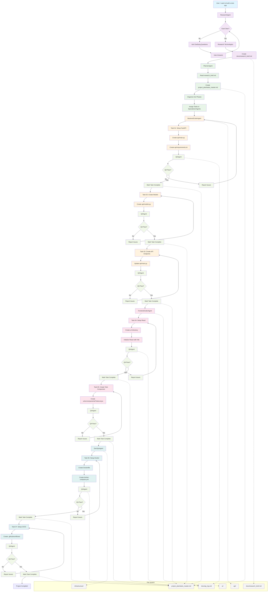
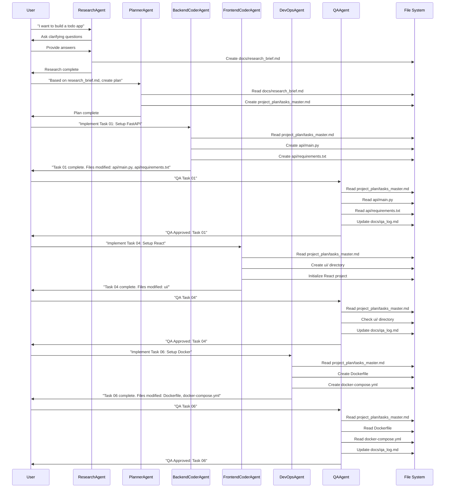
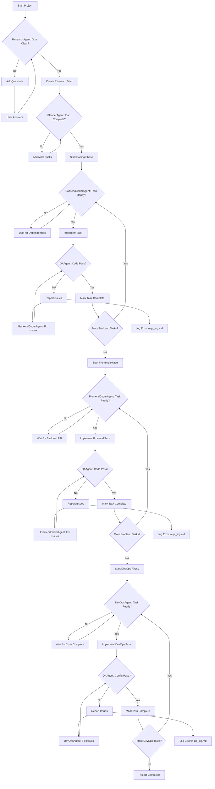
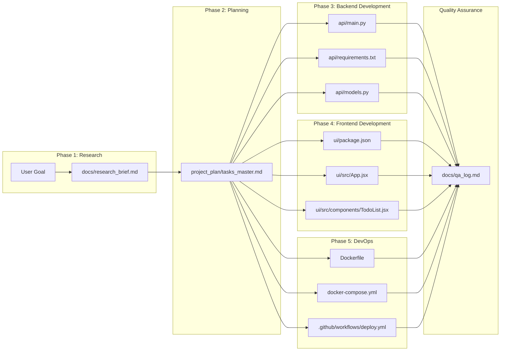

# Overview: AgentV1 vs. AgentV2 Evolution

This project has evolved from `AgentV1` to `AgentV2` to create a more autonomous, integrated, and professional multi-agent system. Here's a quick summary of the key differences:

| Feature           | AgentV1                                     | AgentV2                                                                 |
|-------------------|---------------------------------------------|-------------------------------------------------------------------------|
| **Philosophy**    | Instruction-follower, simpler workflow      | Autonomous, proactive, strategic thinking across agents                 |
| **Task Management** | Markdown files (`tasks_master.md`)          | **Taskwarrior** as the single source of truth for all tasks             |
| **Agent Workflow**| Linear, manual task assignment              | Multi-stage, agents proactively discover and manage their own tasks     |
| **Communication** | Basic chat responses, file modifications    | Richer communication, direct terminal commands, structured logs, model recommendations |
| **Output Format** | Single Markdown report / simple file edits | Direct Taskwarrior commands, detailed research briefs, dedicated logs, model cheatsheets |

This evolution aims to enhance the system's efficiency, traceability, and adherence to professional software development practices.

---
# Agent Workflow Diagram

## Complete Workflow Scenario: Building a Full-Stack Todo App

## Agent Communication Flow

## Decision Points and Error Handling

## File Structure Evolution

