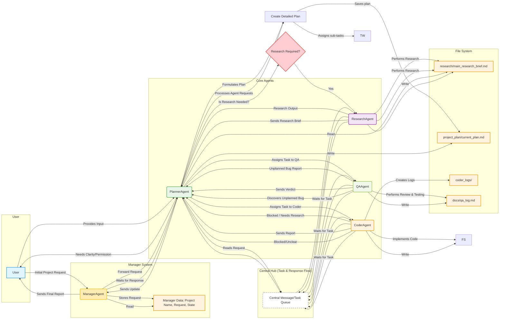

# AgentV3 Proposed Workflow Diagram

This diagram outlines the envisioned `AgentV3` architecture, introducing a central `Manager` agent and emphasizing the `Planner`'s role as a primary orchestrator and communication hub. Agents now operate in a more "broker-like" fashion, waiting for tasks from the Planner and returning direct responses.

